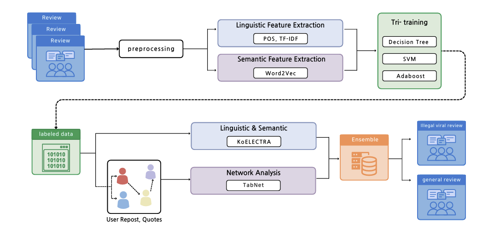
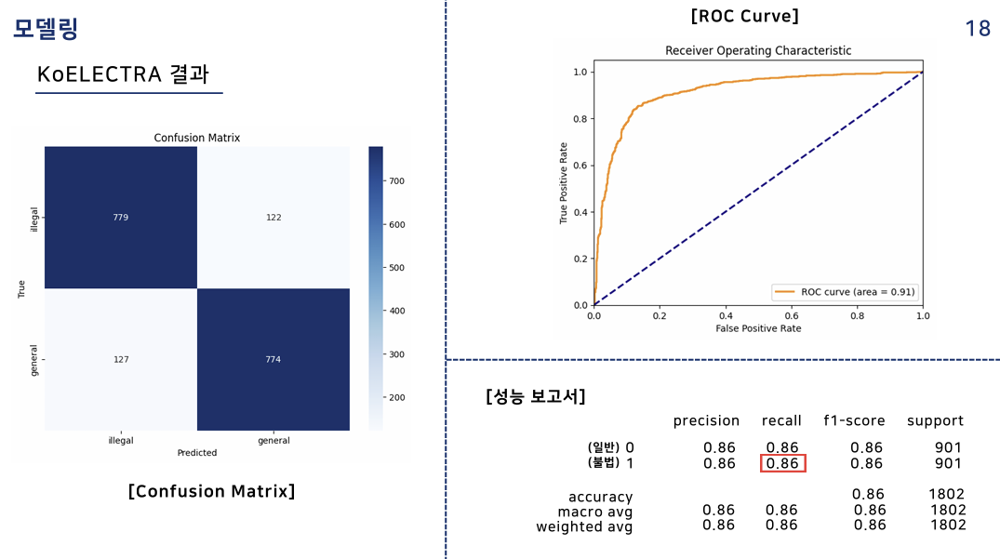
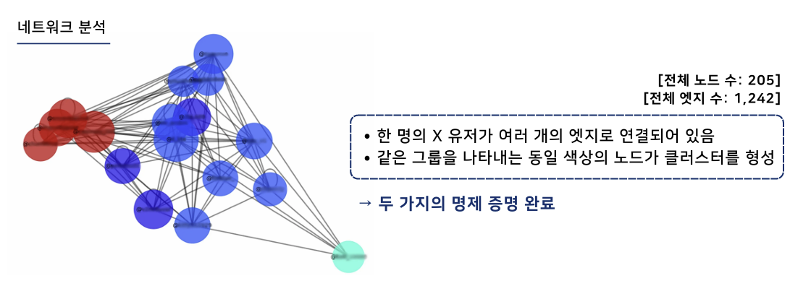
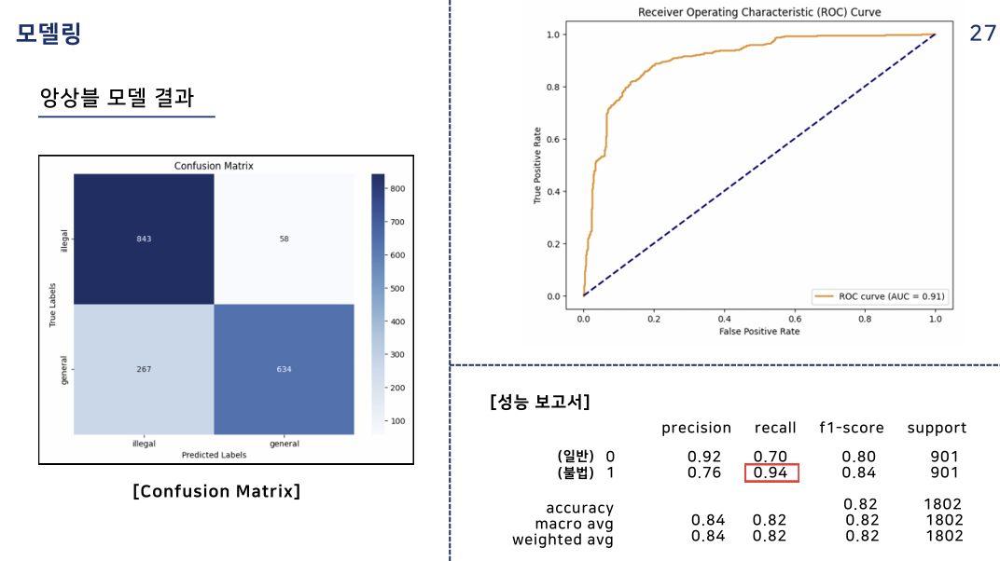

# 🕵️‍♀️ 불법 바이럴 리뷰 탐지 모델 (Illegal Viral Review Detection)
**캡스톤디자인Ⅱ | 데이터사이언스학과 5조 (신한솔 외 4인)**  
언어·의미적 특성과 네트워크 특성을 활용한 불법 바이럴 리뷰 탐지 모델 구축 프로젝트입니다.  
📍 *ICT 플랫폼 학회 2024 추계 학술대회 제출*

---

## 🧭 프로젝트 개요
SNS 상에서 ‘불법 바이럴 리뷰’는 광고임을 밝히지 않은 채 소비자 신뢰를 조작하는 문제를 일으킵니다.  
본 프로젝트는 **언어적·의미적 특성 + 네트워크 구조 분석**을 통해 이러한 리뷰를 자동 탐지하는 모델을 개발했습니다.

---

## 🧩 연구 프레임워크


1. **데이터 수집**  
   - 총 **9,014건(X 리뷰 데이터 및 네트워크 데이터)**  
   - 불법 리뷰 800건 / 일반 리뷰 800건 / 라벨 없는 리뷰 7,414건  

2. **전처리 및 라벨링**  
   - 텍스트 정제 → 불용어 제거 → 토큰화  
   - Tri-Training 기반 반지도 학습으로 라벨 확장  

3. **모델링**  
   - KoELECTRA: 언어·의미적 특성 기반 분류  
   - TabNet: 네트워크 피처 기반 분류  
   - Soft Voting 앙상블 (리콜 향상 중심 설계)

---

## 📊 데이터 구성
> 💾 **총 9,014개의 리뷰 데이터**를 수집·정제하였습니다.  
> 크롤링 및 전처리는 **Google Colab 환경**에서 수행되었으며,  
> 데이터 용량 및 인코딩 문제로 인해 **일부 샘플만 공개**되어 있습니다.  
> 전체 데이터셋은 연구 기록용으로 별도 보관 중입니다.

```
data/
├─ raw/               # 수집 데이터 (라벨 있음/없음)
├─ processed/         # 전처리 완료 및 최종 데이터셋
```

---

## 🧠 코드 구성
```
src/
├─ crawling.py               # 리뷰 데이터 크롤링
├─ network_data_collect.py   # 네트워크 데이터 수집
├─ labeling.ipynb            # 라벨링 및 반지도학습
├─ KoELECTRA_model.py        # 텍스트 기반 모델 학습/추론
└─ 06_analysis_missing       # (앙상블/네트워크 분석 복원 예정)
```

> ℹ️ **왜 .py 인가요?**  
> 일부 노트북(.ipynb)이 GitHub 미리보기에서 `metadata.widgets` 오류로 깨져 보이는 문제가 있어,  
> **출력물이 필요 없는 수집/모델 코드들은 안정적인 `.py` 형태로 공개**했습니다.  
> 실행이 필요하시면 Colab/로컬에서 `.py` 파일을 열어 **셀 단위로 나눠 실행**하시면 됩니다.

---

## 📈 모델 성능 비교
| Model | Feature Type | Accuracy | Recall | F1 |
|:------|:--------------|:---------:|:--------:|:------:|
| KoELECTRA | 언어·의미적 | 0.86 | 0.86 | 0.86 |
| TabNet | 네트워크 | 0.74 | **0.89** | 0.78 |
| Ensemble | 통합 | 0.82 | **0.94** | 0.84 |

---

## 🧩 주요 모델 설명
### 🧠 KoELECTRA
- 한국어 리뷰 텍스트에 특화된 언어 모델로, 문맥 기반 문장 이해 가능  
- 교체 토큰 탐지(RTD)를 활용한 고효율 사전학습 모델  
- 정확도 0.86, 리콜 0.86로 안정적 분류 성능 확보  

### 🌐 TabNet (Network Model)
- 네트워크 중심성·Community·리포스트 횟수 등 구조적 피처 기반  
- 정확도 0.74, 리콜 0.89  
- 네트워크 내 불법 확산 경로 탐지에 효과적  

### 🔗 Ensemble
- KoELECTRA + TabNet 결과를 Soft Voting 방식으로 결합  
- 정확도 0.82, **리콜 0.94**  
- 불법 리뷰 누락률 최소화에 초점  

---

## 🖼️ 주요 시각화 결과
| 연구 프레임워크 | KoELECTRA 결과 | 네트워크 그래프 | 앙상블 모델 결과 |
| :--: | :--: | :--: | :--: |
|  |  |  |  |

---

## 📄 참고 자료
- 발표자료: [`5조최종발표자료.pdf`](./report/5조최종발표자료.pdf)  
- 주요 시각자료: [`figures/`](./figures/) 폴더  
- 관련 연구: *ICT 플랫폼 학회 2024 추계 학술대회 제출본*

---

## 🧰 사용 기술
`Python`, `Pandas`, `Scikit-learn`, `PyTorch`, `KoELECTRA`, `TabNet`, `NetworkX`, `BeautifulSoup`, `Selenium`

---

## ✨ 주요 성과
- **리콜(Recall) 0.94 달성** — 불법 바이럴 탐지 모델로서 높은 탐지 성능  
- **학회 논문 제출 완료 (ICT 플랫폼 학회 2024)**  
- 언어적·의미적 + 네트워크 특성을 통합한 탐지 프레임워크 제안  
- 소비자 보호 및 공정한 온라인 리뷰 생태계 조성에 기여  

---

## 📎 추가 설명
> ⚠️ 일부 코드(앙상블, 네트워크 분석) 및 대용량 데이터는 업로드 용량 제한으로 포함되지 않았으며,  
> 공개된 파일은 핵심 구현 흐름을 중심으로 구성되어 있습니다.
